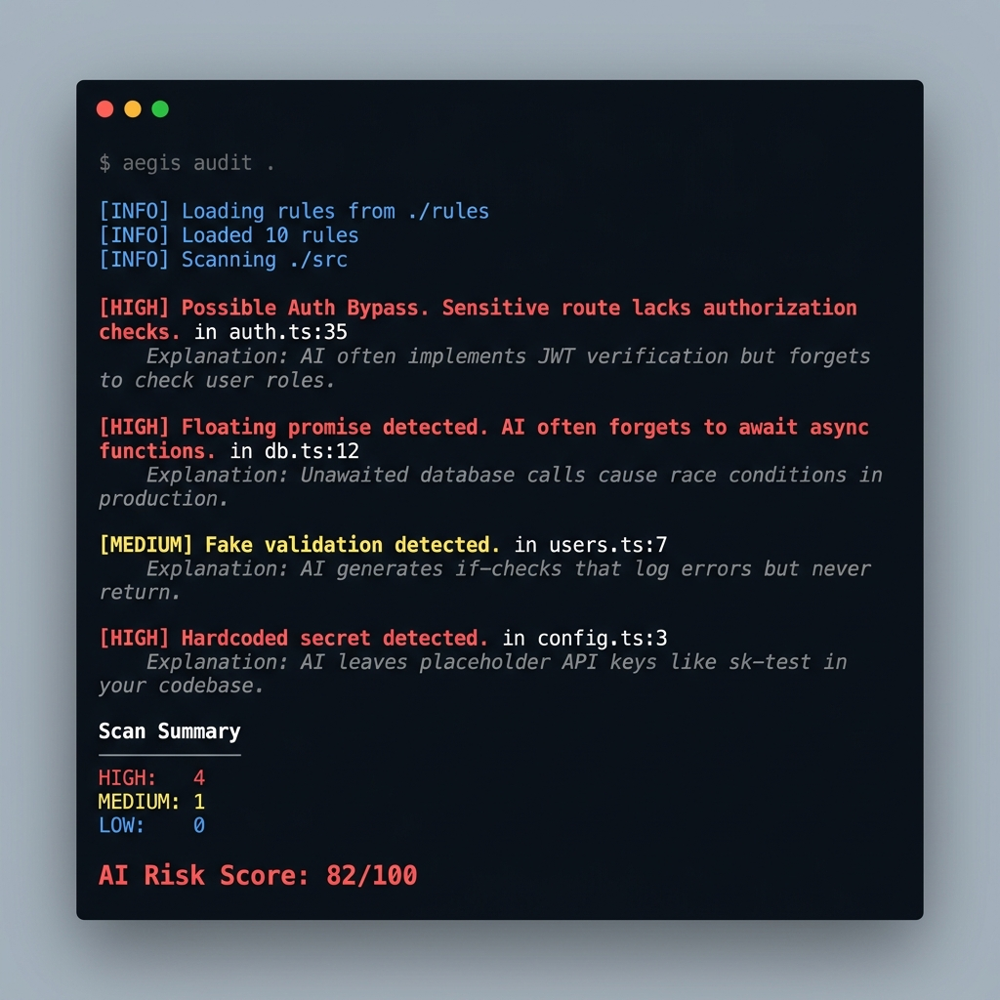

<div align="center">
  
  <h1>Aegis</h1>
  <p><strong>AI-era security scanner for LLM-generated code.</strong></p>
  <p>Detect hallucinated vulnerabilities, auth bypasses, floating promises, and risky AI-generated patterns — before production.</p>

  <br/>

  <a href="#-quick-start"></a>
  <a href="LICENSE"></a>
  <a href="#-rule-showcase"></a>

</div>

<br/>

> **Aegis prioritizes precision over noisy detection. We aim for zero false positives.**

---

## 🚀 Quick Start

```bash
cargo install aegis
aegis audit .
```

That's it. No config needed. No cloud. No API keys. 100% local.

---

## 🖥️ Demo

<div align="center">
  
</div>

```bash
$ aegis audit .

[HIGH] Possible Auth Bypass. Sensitive route lacks authorization (role) checks. in auth.ts:35
    Explanation: AI often implements JWT verification but forgets to check
    if the user actually has the privileges to access the route.

[HIGH] Floating promise detected. AI often forgets to await async functions. in db.ts:12
    Explanation: Unawaited database calls may continue executing after
    the request lifecycle ends, causing race conditions.

[HIGH] Hardcoded secret detected. in config.ts:3
    Explanation: AI coding assistants frequently insert mock API keys
    which developers forget to move into environment variables.

[MEDIUM] Fake validation detected. in users.ts:7
    Explanation: AI generates if-checks that log errors but never return,
    allowing execution to continue past failed validation.

Scan Summary
────────────
HIGH:   8
MEDIUM: 1
LOW:    0

AI Risk Score: 82/100

[!] Found 9 violations
```

---

## 💡 Why Aegis Exists

AI coding assistants (Copilot, Cursor, Claude, DeepSeek) have drastically increased development speed. But they introduced a **new class of bugs** that traditional linters completely miss — because the syntax is perfectly valid. The **logic** is what's broken.

Aegis doesn't ask *"is this code vulnerable?"*
Aegis asks **"did an AI write this, and did it cut corners?"**

We use **Tree-sitter** for AST parsing and a custom **YAML rule engine** to catch these behavioral security flaws with surgical precision.

---

## 🔥 Real AI-Generated Security Failures

These are actual patterns that LLMs produce daily. Aegis catches all of them.

### 1. Forgotten `await` (Race Condition)
```typescript
// AI writes this during refactoring — looks fine, silently breaks everything
app.post('/api/users', (req, res) => {
    db.save(req.body);  // ← No await. Data may never persist.
    res.send("Saved");
});
```

### 2. Fake Validation (Auth Bypass)
```typescript
// AI adds the check but forgets to stop execution
if (!req.body.email) {
    console.log("Email missing");  // ← No return. Code continues below.
}
createUser(req.body);  // ← Runs even without email
```

### 3. Silent Error Swallowing
```typescript
// AI's favorite: catch and forget
try {
    await chargeCustomer(order);
} catch (e) {
    console.log(e);  // ← Payment fails silently. Customer never charged.
}
```

### 4. Hardcoded Placeholder Secrets
```typescript
// AI leaves test credentials that ship to production
const API_KEY = "sk-test-1234567890abcdef";
```

### 5. Open Redirect via User Input
```typescript
// AI takes the shortcut — instant phishing vulnerability
app.get('/redirect', (req, res) => {
    res.redirect(req.query.next);  // ← Attacker controls destination
});
```

---

## 🎯 Rule Showcase

Aegis ships with **10 ultra-high-quality rules** focusing on genuine AI pitfalls.

| Rule ID | Severity | Problem Detected | Why AI Does This |
|---------|----------|------------------|------------------|
| `ai-auth-bypass` | 🔴 HIGH | JWT validated but no role/permission check | AI writes middleware but forgets business logic |
| `ai-floating-promise` | 🔴 HIGH | Unawaited async DB/Network calls | Very common during AI refactoring |
| `ai-silent-fail` | 🔴 HIGH | `catch(e) { console.log(e) }` | AI is lazy with error handling |
| `ai-hardcoded-secret` | 🔴 HIGH | Placeholder API keys left in code | AI inserts `sk-test` and forgets |
| `ai-regex-injection` | 🔴 HIGH | `new RegExp(req.query.q)` | AI passes user input directly to RegExp |
| `ai-open-redirect` | 🔴 HIGH | `res.redirect(req.query.next)` | AI takes shortcuts with redirects |
| `ai-insecure-fetch` | 🔴 HIGH | `rejectUnauthorized: false` | AI disables TLS to "fix" SSL errors |
| `ai-missing-rate-limit` | 🔴 HIGH | Login/OTP route without brute-force protection | AI never adds rate limiting |
| `ai-unsafe-innerhtml` | 🔴 HIGH | `innerHTML = userInput` without sanitization | AI skips DOMPurify |
| `ai-fake-validation` | 🟡 MEDIUM | Validation block that never returns/throws | AI checks but doesn't enforce |

---

## ⚡ Performance

Rust and Tree-sitter make Aegis blazingly fast.

```text
Scanned 12,000 LOC in 0.08s
```

Aegis adds zero noticeable overhead to your CI/CD pipeline.

---

## 🥊 Why not Semgrep?

"Isn't this just Semgrep?" — No. We share architectural inspiration (AST + YAML rules), but we solve a fundamentally different problem.

| | Semgrep | Aegis |
|---|---------|-------|
| **Focus** | Generic SAST | AI behavioral security |
| **Audience** | Security Engineers | Developers using AI Assistants |
| **Detects** | General vulnerabilities (SQLi, XSS) | LLM-specific failure patterns |
| **Strategy** | Broad detection | Precision-first (Zero false-positive goal) |
| **Output** | Standard warnings | Explanation Engine (*Why* the AI made this mistake) |

---

## ⚙️ GitHub Action

Drop Aegis into your CI/CD pipeline. It will automatically audit every Pull Request.

```yaml
name: Aegis Security Audit
on: [push, pull_request]

jobs:
  audit:
    runs-on: ubuntu-latest
    steps:
      - uses: actions/checkout@v3
      - uses: vahapogut/aegis-action@v1
        with:
          format: 'sarif'
```

---

## 🔌 Output Formats

Aegis supports JSON and SARIF output for easy integration with GitHub Security tab, Datadog, or custom dashboards.

```bash
aegis audit . --format json
aegis audit . --format text   # default, colored terminal output
```

---

## 📖 Writing Custom Rules

Aegis rules are YAML files with Tree-sitter queries. See [CONTRIBUTING.md](CONTRIBUTING.md) for the full guide.

```yaml
rule:
  id: "ai-your-pattern"
  language: "typescript"
  confidence: "HIGH"
  message: "Short description of the bug."
  explanation: "Why the AI does this and how to fix it."
  query: >
    (catch_clause
      body: (statement_block) @block
      (#not-match? @block "throw|return")
    )
```

---

## 📜 License

Apache-2.0. Built for the community by [IPEC Labs](mailto:info@ipeclabs.com).
